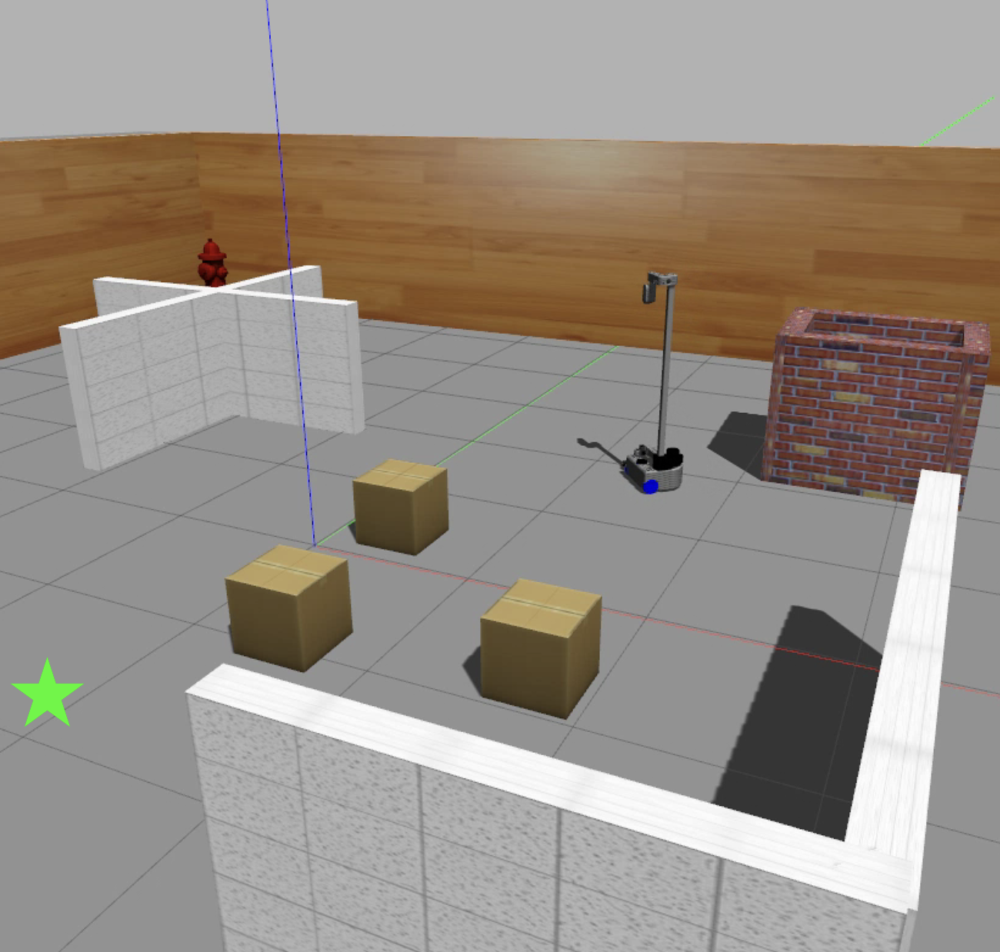
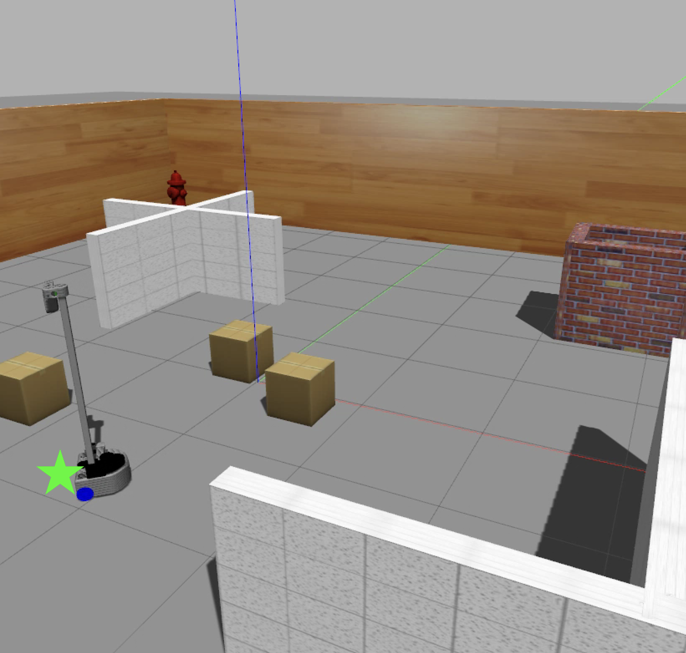

# Stretch DRL Navigation


Deep Reinforcement Learning for Stretch RE1 with dynamic obstacle avoidance in ROS Gazebo simulator. We use TD3 with memory to train a Stretch agent to navigate to goal location with fused visual data.

Screenshots:
<p align="center">
    
</p>

<p align="center">
    
</p>

## Installation
To get started, install the following: 

* [ROS Noetic](http://wiki.ros.org/noetic/Installation)
* [PyTorch](https://pytorch.org/get-started/locally/)
* [Tensorboard](https://github.com/tensorflow/tensorboard)

Clone the repository:
```shell
$ cd ~
$ git clone git@github.com:VLR-Project-Team/Stretch-DRL.git ws
```

Compile the workspace:
```shell
$ cd ~/ws/catkin_ws
### Compile
$ catkin_make
```

Open a terminal and set up sources:
```shell
$ export ROS_HOSTNAME=localhost
$ export ROS_MASTER_URI=http://localhost:11611
$ export ROS_PORT_SIM=11611
$ export GAZEBO_RESOURCE_PATH=~/ws/catkin_ws/src/multi_robot_scenario/launch
$ source ~/.bashrc
$ cd ~/ws/catkin_ws
$ source devel/setup.bash
```

## Source the setup file (Alternative to above)
This will build the catkin workspace and cd to the TD3 directory:
```shell
cd ws/
source setup.sh
```

## Training
To train the model, run the following command:
```shell
python3 train.py
```

## Inference
To run the trained model, run the following command:
```shell
python3 test.py
```
